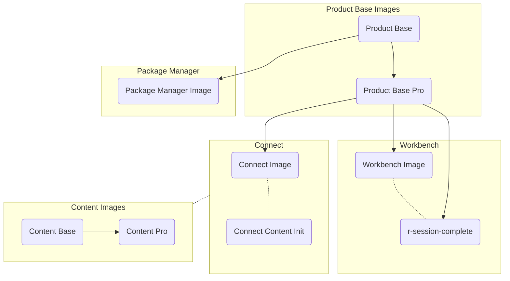

# RStudio Pro Products Docker Images

Docker images for RStudio Professional Products

**IMPORTANT:** There are a few things you need to know before using these images:

1. This image may introduce **BREAKING** changes; as such we recommend:
   - Avoid using the `{operating-system}` tags to avoid unexpected version changes, and
   - Always read through the NEWS.md file in the appropriate sub-folder to understand the changes before updating.
1. Outdated images will be removed periodically from DockerHub as product version updates are made. Please make plans to
   update at times or use your own build of the images.
1. These images are meant as a starting point for your needs. Consider creating a fork of this repo, where you can
   continue to merge in changes we make while having your own security scanning, base OS in use, or other custom
   changes. We
   provide [instructions for building](https://github.com/rstudio/rstudio-docker-products#instructions-for-building) for
   these cases.
1. **Security Note:** These images are provided AS IS based on the build environment at the time their product version was released/updated. They should be reviewed and updated before production use. If your organization has a specific set of security requirements related to CVE/Vulnerability severity levels, you should plan to use the [instructions for building](https://github.com/rstudio/rstudio-docker-products#instructions-for-building) to clone this repository, and rebuild these images to your specific internal security standards.

 
# Images

### Professional Products

- [RStudio Workbench](./workbench/)
- [RStudio Connect](./connect/)
- [RStudio Package Manager](./package-manager/)

### Supporting Images

- RStudio Workbench Session Images (requires the launcher)
    - [R Session Complete](./r-session-complete/)
- Product Base Images
    - [Product Base](./product/base)
    - [Product Base Pro (includes Pro Drivers)](./product/pro)
- RStudio Connect Session Images (requires the launcher)
    - [Content Base Image](./content/base/)
    - [Content Base + Pro Driver Image](./content/pro/)
    - [Content Init Container](./connect-content-init/)

### Preview Images

*IMPORTANT:* Do not use these images. They are in preparation for a future release

- [RStudio Workbench Preview and Daily](./workbench/)
- [RStudio Connect Daily](./connect/)
- [RStudio Package Manager Daily](./package-manager/)

### Image Hierarchy And Relationship

- solid line / arrow: image inheritance
- dashed line: images related to one another by usage



# RStudio Team

We provide a `docker-compose.yml` that could help to spin up default configurations for RStudio Team (all RStudio
products together).

If you are using this locally you need to setup some hostnames to point to `localhost` in order for some integrations to
work fine in your browser. In your `/etc/hosts` add one line:

```
127.0.0.1 rstudio-workbench rstudio-connect rstudio-pm
```

```bash
# Replace this with valid licenses
export RSW_LICENSE=XXXX-XXXX-XXXX-XXXX-XXXX-XXXX-XXXX
export RSC_LICENSE=XXXX-XXXX-XXXX-XXXX-XXXX-XXXX-XXXX
export RSPM_LICENSE=XXXX-XXXX-XXXX-XXXX-XXXX-XXXX-XXXX

docker-compose up
```

# Privileged Containers

As of July 2022, only the RStudio Connect container uses the `--privileged` flag for user and code isolation and 
security and all other images can be run unprivileged. Please see 
[RStudio Professional Product Root & Privileged Requirements](https://support.rstudio.com/hc/en-us/articles/1500005369282)
for more information.

If you have feedback on any of our professional products, please always feel free to reach
out [on RStudio Community](https://community.rstudio.com/c/r-admin), to your Customer Success representative, or to
sales@rstudio.com.

# Instructions for building

After you have cloned [rstudio-docker-products](https://github.com/rstudio/rstudio-docker-products), you can create your
own containers fairly simply with the provided Justfiles. If you're unfamiliar with `just`, please check out 
[their documentation](https://just.systems/man/en). If you are unable to use `just` in your organization,
most targets in each Justfile can be copy/pasted into your shell and ran there with variables replaced where 
appropriate.

We now orchestrate all our builds using `docker buildx bake`. You can learn more about the tool on 
[Docker's buildx bake page](https://docs.docker.com/build/bake/), however no additional background knowledge is needed
on the tool in order to use it.

To build all images:
```bash
just build
```
Individual images or groups of images can also be built:
```bash
just bake connect-images
```

Here are the available targets and groups in bake. To build one, use `just bake <target>`:
- `build` - Builds all images
- `base-images` - Builds `product/base` and `product/pro`
- `package-manager-images` - Builds `package-manager`
- `connect-images` - Builds `connect`
- `workbench-images` - Builds `workbench`
- `connect-content-images` - Builds `connect-content-init`
- `r-session-complete-images` - Builds `r-session-complete`
- `wgcw-images` - Builds `workbench-for-google-cloud-workstations`
- `waml-images` - Builds `workbench-for-microsoft-azure-ml`

Preview images and content images are also available to build through the `docker-bake.preview.hcl` and 
`content/docker-bake.hcl` files respectively or use `just preview-bake` and `just content-bake`. 

You can alter what exactly is built by changing `workbench/Dockerfile.$OS`, `connect/Dockerfile.$OS`,
and `package-manager/Dockerfile.$OS`. Keep in mind that `product/base` or `product/pro` also impact what our default
images contain.

You can then run what you've built to test out with the `run` commands. For instance, to run the workbench container
you have built:
```
just workbench/run
```

Note you must have a license in place, and all other instructions in separate sections are still relevant.

If you have created an image you want to use yourself, you can push to your own image repository system. The images are
named `rstudio-workbench`, `rstudio-connect`, and `rstudio-package-manager`.

# Licensing

The license associated with the RStudio Docker Products repository is
located [in LICENSE.md](https://github.com/rstudio/rstudio-docker-products/blob/main/LICENSE.md).

As is the case with all container images, the images themselves also contain other software which may be under other
licenses (i.e. bash, linux, system libraries, etc., along with any other direct or indirect dependencies of the primary
software being contained).

It is an image user's responsibility to ensure that use of this image (and any of its dependent layers) complies with
all relevant licenses for the software contained in the image.
