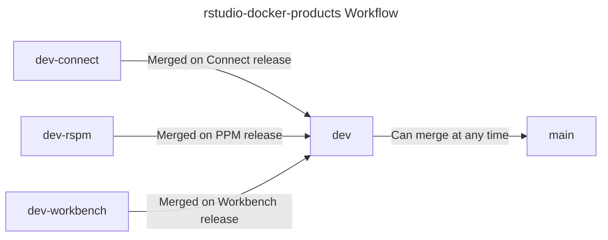

# Release Process

The release process for these docker images is maintained [on Docker
Hub](https://hub.docker.com/u/rstudio) in the RStudio organization.

## Updating Product Versions

To update the version for the `rstudio/rstudio-connect` image, for instance:
- update the `RSC_VERSION` number in the [`Justfile`](./Justfile)
- run `just update-versions`
- submit a PR
- the next build on `main` will tag the image with the appropriate version
  number

For RStudio Connect, edit `RSC_VERSION`.

For RStudio Workbench, edit `RSW_VERSION`.

For RStudio Package Manager, edit `RSPM_VERSION`.

**IMPORTANT NOTE:** The "default" ARG value in the respective `Dockerfile` has
no effect on the build process

## Building Images in CI

GitHub Actions build a matrix of many images:

- on every push to `main`
- on PRs into `main`

In addition, for builds that run on main (some are scheduled, there are webhooks, etc.),
we also push to [Docker Hub](https://hub.docker.com/u/rstudio) and [GitHub Container Registry](https://ghcr.io)

- The `main` branch builds preview / daily images every morning (pulling new product versions)
- The `dev` branch (or product specific branches) can build preview / daily
  images on demand (using webhooks), but usually only builds based on merges to
  the respective branches

### Preview Images

We also build a matrix of "preview" images. There are two axes that we "preview":

- the `main` version of the Dockerfiles, with "development" or "preview" versions of the products 
- the `dev` version of the Dockerfiles (with "released," "development," and "preview" versions of the products)
- we also build product-specific dev branches too: `dev-rspm`, `dev-connect`, `dev-workbench`

These are mostly used during the development cycle, when:

- a product is preparing for release
- product changes require the docker container to be changed in some way (i.e.
  how you install a dependency changes)
- system dependencies / container image contents change in a way that could
  break customers (we batch such changes into product releases)

## Branching Paradigm

The `main` branch deploys our usable images.
The `dev` branch is "default" for PRs, branches, and code merging. Any code
merged here should be "ready to merge" at any time. Sometimes we hold up the `dev`
branch for testing, burn in, integration testing, etc.
`dev-product` branches are used for individual product changes.

You can see this overviewed in the diagram below



## Testing Locally

It is possible to test locally from a product directory by using:

```
just test
```

If you want to write goss tests,
[`dgoss`](https://github.com/aelsabbahy/goss/tree/master/extras/dgoss)
simplifies the process.

- install
  [`dgoss`](https://github.com/aelsabbahy/goss/tree/master/extras/dgoss)
locally
- run the following to create tests interactively:
```
# from ./connect
GOSS_PATH=/path/to/local/goss GOSS_FILES_PATH=./test dgoss edit -it -e RSC_VERSION=1.9.0 rstudio/rstudio-connect

# once in the container
/bin/bash		# shell of preference?
goss validate
goss add --help
```
- to run the test suite as-is
```
# from ./connect
GOSS_PATH=/path/to/local/goss GOSS_FILES_PATH=./test dgoss run -it -e RSC_VERSION=1.9.0 rstudio/rstudio-connect
```
